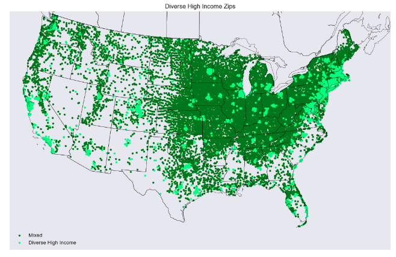
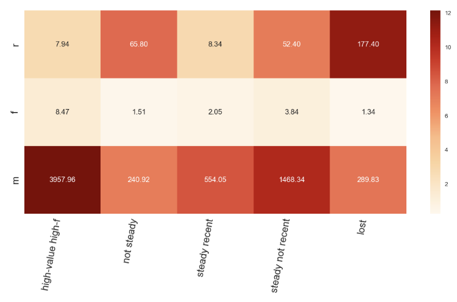
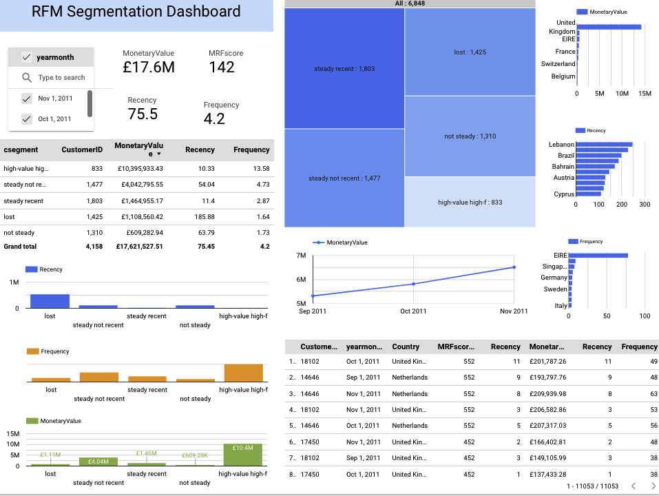

# 
Segmentation

## Demographic Market Segmentation with Census Data

[Census Zipcode Demographics Segmentation Notebook](https://github.com/Aljgutier/segmentation/blob/main/CensusSegmentation.ipynb) - Zip Code Demographic Segmentation based on Race, Ethnicity, Education, Income, Industry, and Occupation. Methods include K-means, Elbow Method, Silhoute Analysis/Score, geographic visulization with cartopy.

<figure>
 
 <figcaption>Figure 1. Census Segementation: Diverse and Diverse High Income Zip Codes</figcaption>
 </figure>

## RFM Segmentation Online Sales Jupyter Notebook

[RFM Segmentation Onlne Sales Jupyter Notebook](https://github.com/Aljgutier/segmentation/blob/main/RFM_Segmentation_OnlineSales.ipynb) - The notebook develops RFM (Recency, Frequency and Monetary Value) a (K-means) clustering/segmentation and Minimum Euclidean Distance Model. In addition the notebook includes data transformations to generate BI data based on 9 month sliding window (monthly) to generate RFM and Segmentation BI data for 3 consecutive months - September, October, November. The BI data is the input for the RFM BI Segmentation BI Dashboard (below).

<figure>
 
 <figcaption>
Figure 2. RFM Segmentation BI Dashboard
</figcaption>
 </figure>

 Clustering methodology
 * Create RFM dataframe
 * Transform - deskew with boxcox and standize (Standard Scaler)
 * k-means clustering
 * Choose the number of clusters with the help of the following methods
   * Elbow Method based on WCSS (within cluster sum of squares)
   * Silhouette Score = $(b-a)/max(a,b)$, where $a$ is the mean intra-cluster score $b$ and average inter-cluster distance.
   * Heatmap with human interpretation of the clusters (see Figure 2, above)
   * Three dimensional Scatter plot analysis

## RFM Segmentatin Online Sales Looker Studio BI Dashboard

[RFM Segmentation BI Dashboard](https://lookerstudio.google.com/reporting/04a3119c-46d5-4642-a3b9-d9730ab27f9f/page/9YsID) - BI RFM and Segmentation based on 9 month intervals for three consecutive months. The data for the RFM BI dahsboard is hosted as a Big Query View (see paragraph below for further details about the data).

 The Dashboard provides insights to the Marketing direcctor showing the RFM KPIs and scores over time (monthly increments), trends, RFM by country, and customer for three consecutive sliding 9-month periods. The following insights and visuals are provided
* RFM KPIs
* Customer Segments (idenified by the clustering algorithm - see notebook above)
* RFM values for each customer segment
* RFM breakouts by country
* RFM scores by customer (detail table)

<figure>
 
 <figcaption>
Figure 3. RFM Segmentation BI Dashboard
</figcaption>
 </figure>

The source data is the same as for the notebook above (online sales from UCI ML data). The notebook outputs two tables -  detailed RFM_BI data with cluster id for each customer and RFM cluster centers. These two tables are subsequently loaded to Big Query and joined along with the maximum RFM aggregates for each year-month, and subsequently a view is created. This view serves as the dashboard source data.